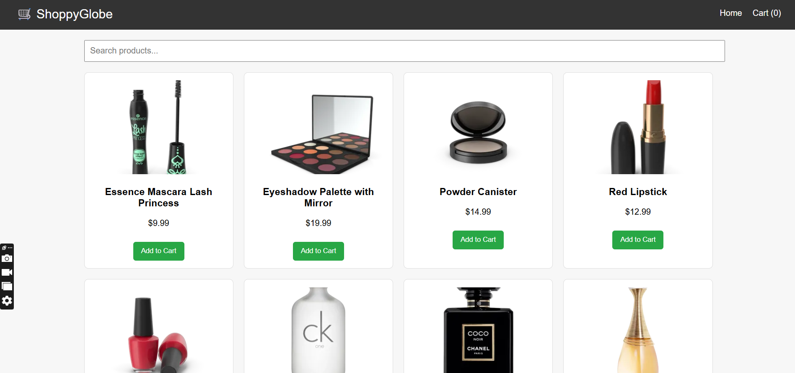

# 🛍️ ShoppyGlobe - E-commerce React Application

ShoppyGlobe is a simple e-commerce application built with **React**, **Redux**, and **React Router** using **Vite**. It fetches product data from an API, allows users to add/remove items to/from the cart, and handles routing and state management cleanly.

---

## 🔧 Features

- ✅ Product listing fetched from [dummyjson.com/products](https://dummyjson.com/products)
- ✅ View detailed information for each product
- ✅ Add to cart and manage cart items
- ✅ Search products by title
- ✅ React Router for navigation
- ✅ Redux Toolkit for cart state management
- ✅ Lazy loading for improved performance
- ✅ Responsive layout using plain CSS

---

## 📁 Folder Structure

src/
├── components/ # UI Components
├── redux/ # Redux store and slice
├── hooks/ # Custom hooks
├── App.jsx # Main App component
├── main.jsx # Entry point
├── index.css # Global styles

---

## 🛠️ Technologies Used

- React (with Vite)
- Redux Toolkit
- React Router DOM
- Plain CSS (Responsive)
- JavaScript (no TypeScript)

---

## 🖥️ Local Setup Instructions

# Clone the repository
git clone https://github.com/your-username/shoppyglobe.git

# Navigate into the folder
cd shoppyglobe

# Install dependencies
npm install

# Run development server
npm run dev

# Open your browser at:
http://localhost:5173

📸 Screenshots

🙋‍♂️ Author
Made with ❤️ by [Arti Maurya]

# React + Vite

This template provides a minimal setup to get React working in Vite with HMR and some ESLint rules.

Currently, two official plugins are available:

- [@vitejs/plugin-react](https://github.com/vitejs/vite-plugin-react/blob/main/packages/plugin-react) uses [Babel](https://babeljs.io/) for Fast Refresh
- [@vitejs/plugin-react-swc](https://github.com/vitejs/vite-plugin-react/blob/main/packages/plugin-react-swc) uses [SWC](https://swc.rs/) for Fast Refresh

## Expanding the ESLint configuration

If you are developing a production application, we recommend using TypeScript with type-aware lint rules enabled. Check out the [TS template](https://github.com/vitejs/vite/tree/main/packages/create-vite/template-react-ts) for information on how to integrate TypeScript and [`typescript-eslint`](https://typescript-eslint.io) in your project.
